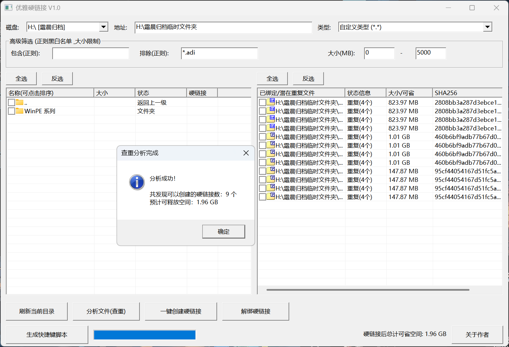
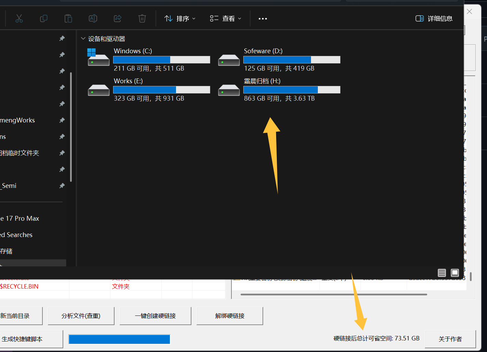
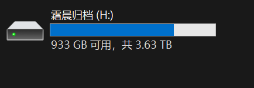
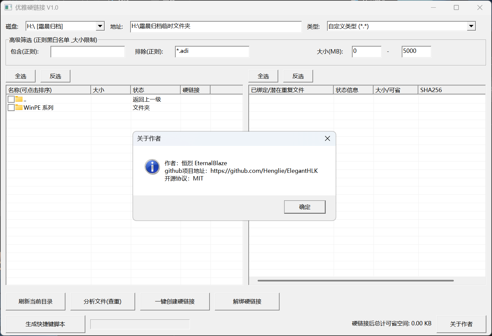

# ElegantHLK (优雅硬链接) 🔗

> 一款**开源的**Windows下的NTFS文件系统的硬链接批量创建和管理工具，常用于运维以及文件备份，空间节省。它能够智能扫描指定目录下的重复文件，并将其一键转换为硬链接，从而在不影响文件正常使用的情况下，最大化释放你的物理磁盘空间。

- **当前版本：** v1.6
- **时间：** *2026年10月10日*
- **国内网盘分流**
- 百度网盘：https://pan.baidu.com/s/1bTYxI6l-_RKIJSQ0RnCdYQ?pwd=0000
- 夸克网盘：https://pan.quark.cn/s/2b00811d7a6a

v1.6 更新

1. 【设置统一入口】原「语言」「主题」「字号」三个按钮合并为一个「设置」按钮，点开是语言 / 主题 / 字号三个级联子菜单，选项和记忆逻辑不变，界面更清爽。
2. 【分栏拖拽修复】左右列表中间的拖拽分隔条现在严格限定在两个列表的高度范围内才会生效（光标变化与拖拽均是），不再影响上方的地址栏、类型下拉框等控件；分隔槽的绘制范围同样收窄到列表区域。

v1.5 更新

1. 【字号设置】列表上方新增「字号」按钮，提供小（10 号字）/标准（11 号字）/大（12 号字）/特大（14 号字）四档界面字号，选择会被记住，下次启动直接生效，高分屏下同样按缩放计算。
2. 【可拖拽分栏】左右两个列表中间的间隔现在可以按住鼠标左右拖动，路径较短的场合可以把左栏收窄、把空间让给路径较长的右栏；分栏比例会自动记住。
3. 【打开本组所有位置】在右侧重复列表中对任一文件双击（或右键选「打开本组所有文件位置」），会同时在资源管理器中定位本组全部重复文件，方便逐个核对后再清理。
4. 【勾选保持高亮】点击复选框的行现在会保持选中高亮（多次勾选会叠加高亮），不再出现「刚选中的文件点一下就褪色」的困惑。

v1.4 更新

1. 【彻底修复 UTF-8 代码页乱码】v1.1.2 曾用应用清单（manifest）声明进程使用传统代码页来规避乱码，但仍有用户实测（issue #13）在 Windows 11 上开启「Beta 版：使用 Unicode UTF-8 提供全球语言支持」后界面乱码。本版按微软官方推荐做法把整个程序重构为宽字符（W 版）Win32 API：界面文字、文件扫描、路径处理全部使用 UTF-16，与系统 ANSI 代码页彻底无关，无论系统代码页是 GBK 还是 UTF-8 都不会乱码。功能、界面、XP 兼容性与体积均无变化；导出的 CSV/TXT 清单同时升级为带 BOM 的 UTF-8 编码，Excel 打开不乱码。

v1.3 更新

1. 【软连接模式】新增软连接（符号链接）支持。勾选底部新增的「软连接模式」复选框后，「一键创建硬链接」按钮变为「一键创建软连接」，会把每组重复文件转换为指向组内第 1 个文件的软连接。软连接可以跨盘符（硬链接不行），特别适合备份场景：原始文件留在原地，其他位置用软连接指向它，一样省空间。注意：软连接只是链接，源文件被移动或删除后链接会失效；创建软连接需要管理员权限，或在 Win10 创意者更新及以上系统开启「开发者模式」（权限不足时会弹窗说明）。Windows XP 没有软连接 API，程序会提前提示不支持。

2. 【ACL 权限兜底】有些文件即使以管理员身份运行也访问不了（所有者是 TrustedInstaller、SYSTEM，或权限表压根没给管理员留条目）。本版实现权限兜底：遇到拒绝访问的文件时，自动启用 SeTakeOwnership/SeRestore/SeBackup 特权，临时把该文件所有者接管为 Administrators 并补一条完全控制条目，处理完后再还原原来的所有者与权限表。扫描、分析、转换、解绑全流程都接了兜底，本轮接管次数会在完成弹窗里汇报。

3. 【列表多选】左侧文件列表与右侧重复列表都支持多选勾选：按住 Shift 点首尾两行，范围内全部勾选/取消（以起点行的勾选状态为准）；按住 Ctrl 单击自由勾选/取消单个文件；配合原有的全选/反选按钮，批量操作不再需要一行一行点。

4. 【性能与修缮】分析阶段内存占用约省一半（下标代替整份文件记录拷贝分组）；重复组展示不再逐个文件二次打开句柄查链接数；递归收集时跳过软连接避免死循环；修复空路径越界隐患；被其他程序占用的文件哈希时不再直接判为失败。

> 更早版本的更新记录见 [更新日志.md](./更新日志.md)。

---

## 00 科普 和 介绍 

### 什么是硬链接？

NTFS硬链接就像是给同一个文件起了多个不同的"名字"，这些名字都指向硬盘上同一份实际数据，无论通过哪个名字修改，内容都会同步变化。
它跟复制文件完全不同——复制会占用两份空间，而硬链接无论创建多少个，都只占用原文件的那一份磁盘空间。
只有当最后一个"名字"被删除后，文件才真正从硬盘消失，就像一把钥匙配多把锁，必须所有锁都拆了，门才能彻底打开。  

### 这个程序干什么用的？

用来文件查重，并且一键删除多余的数据**（不是删除你的文件！）**，可以让我们在不删除文件的情况下，挤出这些重复文件所占的多余空间！

并且在介绍里我也说了，这个程序可用于**文件备份清理**、**硬盘屯屯鼠**、以及一些拥有大量存储空间，但是重复文件过多的人群！

### 这个程序和市面上那些已有程序有什么优势

优势可大了！
①我这个程序开源！并且是较为宽松的MIT协议！
②我这个程序可以用列表的形式直观呈现是否硬链接，是否可以创建，还会自动统计一次清除能节省多少空间！
③程序和代码及其小巧！程序本身只有130KB！还不够你一张自拍照大！
④性能极其优越！本程序**采用C/C++编写**、GUI程序功能使用的是完全的Windows原生api（连SHA256都是！）。使用的GDI+库，让你在高分辨率2K屏、4K屏下都能自适应缩放，**完全不会像老程序一样模糊**

### 怎么看出程序有用的？

使用程序扫描清理完后，从文件属性看，空间占用似乎不变。可是！请你看看盘符界面，硬盘的空余空间却变大了！这就是有用，这就是真实的空余空间，不是虚假的！

## 01✨ 核心功能

- **重复文件分析**：使用 SHA-256 哈希算法，对文件内容进行精确比对，精准找出深层目录结构中的重复文件。（文件夹下所有内容！）
- **一键批量硬链接转换**：一键将所有重复文件转换为硬链接。程序会自动保留每组的第一个文件作为源文件**数据**，并“永久释放”其余物理文件以释放空间，同时在界面上直观展示总计可省空间。【释放文件数据并不会导致其他地方的文件被删除，而是所有相同文件都会指向同一个数据！这样会节省大量空间，**可在硬盘剩余空间展示出效果**！】
- **丰富的类型过滤器**：下拉菜单内置了多种常用文件过滤规则，包括：常用视频、高清/蓝光视频、音频、图片素材、执行文件、压缩包以及文档等，也支持自定义 `*.*` 扫描。我没想搞太多格式的筛选，暂时先添加这么多了
- **高分屏 (High DPI) 适配**：底层通过调用 GDI+ 实现了原生的 `SetProcessDPIAware` 高分辨率显示支持，确保在现代高分屏显示器上界面清晰锐利。并且，这是原生的GUI绘制方案，不依赖第三方各种庞大的框架，**把程序体积控制在150KB以内**！
- **右键上下文菜单**：支持在文件列表中右键复制文件名 / 完整路径 / SHA256，在资源管理器中定位、送回收站删除（可还原），以及对已建立的硬链接进行解绑还原。
- **中英双语界面**：自动识别系统语言，非中文系统默认英文，也可以在界面上一键切换，选择自动记忆。
- **昼夜模式**：自动跟随系统明暗主题，也可手动锁定浅色/深色，纯原生绘制无新增依赖。
- **重复副本直接删除**：不想用硬链接的用户，可以每组保留一份、其余重复副本一键送入回收站。
- **软连接模式**：勾选「软连接模式」后，一键把重复文件转换为指向源文件的软连接，可跨盘符使用，备份场景更灵活（需管理员权限或 Win10 开发者模式）。
- **ACL 权限兜底**：TrustedInstaller/SYSTEM 等特殊所有者、权限表拒绝访问的文件也能处理——自动启用特权接管所有权并补权限条目，处理完按需还原。
- **列表多选**：Shift 点首尾范围内全勾/全不勾，Ctrl 单击自由勾选，批量操作更顺手。

## 02🛠️ 开发相关信息

- **开发语言**：C/C++
- **图形界面**：原生 Win32 API 和 GDI+
- **查重算法**：Windows CryptAPI (计算 SHA-256)
- **极佳的兼容性**：宏定义 `_WIN32_WINNT 0x0501`，保持了对早期操作系统（如 Windows XP）的兼容支持，同时解决基础版 XP SDK 隐藏 SHA256 宏的问题。本项目的目的就在于给硬盘数据做极致的空间整理，不管你的电脑有多老！（到xp都行）

## 03🚀 快速上手and快速教程

1. 在顶部下拉框选择需要扫描的 **磁盘** 或手动输入 **地址**。
2. 选择需要查找的 **文件类型** 过滤器（也可以不选）。
3. 点击 **分析文件(查重)**，等待右侧列表显示出相同 SHA-256 的重复文件组。
4. 确认无误后，点击 **一键创建硬链接** 完成物理文件的释放与替换。

## 📄 许可协议与作者

- **作者**：*恒烈 (EternalBlaze)*

- **项目地址**：https://github.com/Henglie/ElegantHLK

- **开源协议**：本项目基于 **MIT** 协议开源。

## 📜 历史更新日志

> 历史版本（v1.0 及更早）的更新记录已移至 [更新日志/历史更新日志.md](./更新日志/历史更新日志.md)。
